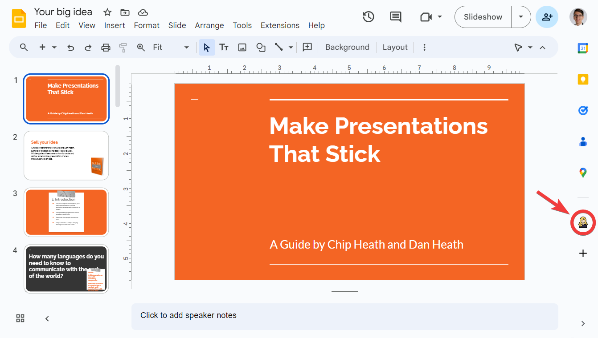
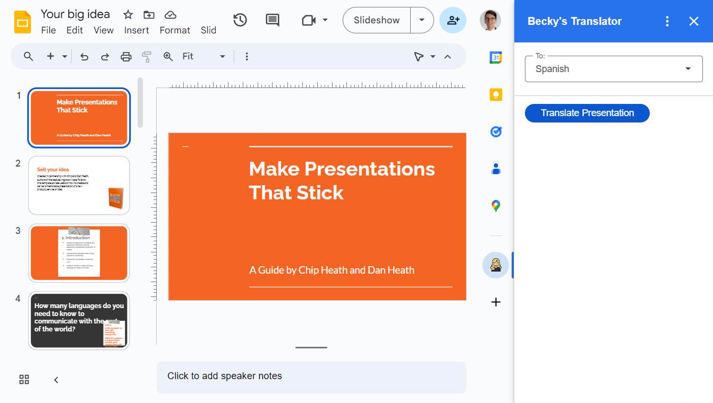

# Becky's Slides Translator

A [Google Workspace add-on](https://developers.google.com/workspace/add-ons/overview) written in Google Apps Script for translating Google Slides presentations to other languages. Created for my friend Becky who teaches at a high school in Dallas.

## Overview

This code is based on Google's sample translate add-ons ([here](https://developers.google.com/workspace/add-ons/samples/translate-addon-sample) and [here](https://developers.google.com/workspace/add-ons/editors/slides/quickstart/translate)). Whereas those add-ons let users translate individual text selections, this add-on is intended to translate entire presentations with the click of a button.

## Installation

To install this add-on, you will need to create a Google Apps Script project and a Google Cloud project. See [this guide](https://developers.google.com/workspace/add-ons/how-tos/building-workspace-addons). Once the Apps Script project is created, copy the `appsscript.json` and `translator.gs` source files from this repository into the Apps Script project.

You can then [install the unpublished add-on](https://developers.google.com/workspace/add-ons/how-tos/testing-workspace-addons#install_an_unpublished_add-on), at which point it should be visible in the sidebar of the Google Slides editor for your Google account:

Clicking on the icon reveals the add-on:

